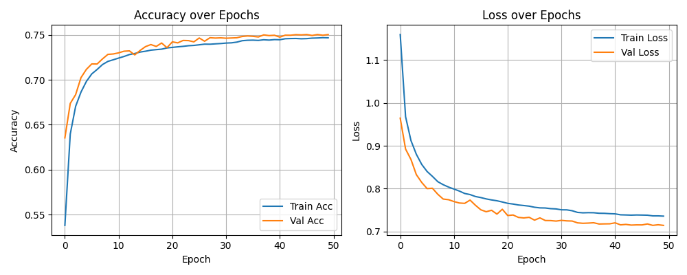
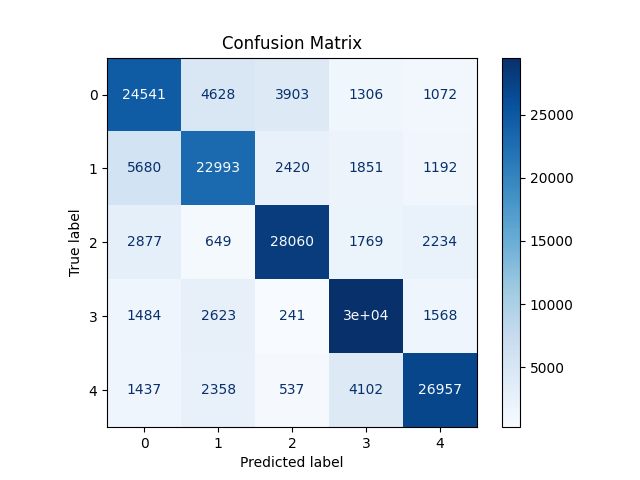

# JetNet Attention-Based Jet Classifier

This project implements a deep learning model to classify particle jets using the [JetNet dataset](https://zenodo.org/record/6975118).  
The model incorporates transformer-style layers (multi-head self-attention, pooling by multi-head attention) to sets of particle features, making it naturally suited for the unordered structure of jets.  

---

## Dataset: JetNet

The [JetNet dataset](https://zenodo.org/record/6975118) provides simulated particle jets labeled by their origin:

- **0**: Gluon  
- **1**: Quark  
- **2**: Top  
- **3**: W boson  
- **4**: Z boson  

Each jet is represented by up to **30 particles**, each with **4 features** (kinematics).  
The dataset size used here: **880,000 jets** (704k train / 176k validation).  

---

## Model Outline

The model processes jets of shape `(30, 4)` using:

- **Input embedding**: Dense layer with GELU activation  
- **Transformer encoder blocks**:  
  - Multi-Head-Attention
  - Pre-Norm Layer Normalization  
  - Residual connections  
  - Feed-forward MLP with GELU  
- **Channel attention** (Squeeze-Excitation block to reweight features)  
- **Pooling by Multi-Head Attention (PMA)** with multiple learnable seed vectors for set summarization  
- **Classifier head**: Dense layers with dropout regularization, final softmax over 5 jet classes  

Custom features include:
- Early stopping, learning-rate scheduling, and model checkpointing  
- Training curves and confusion matrix visualizations  
- Classification report with precision, recall, and F1-score  

---

## Key Contributions and Use Cases

- **Classifies 5 jet types** (gluon, quark, top, W, Z) from particle-level features.  
- Uses **transformer attention mechanisms** to model particle–particle relationships inside a jet.  
- Lightweight architecture compared to graph-based models like ParticleNet, while achieving competitive performance.  
- Serves as a **baseline for physics ML research** or a **portfolio project** demonstrating modern deep learning applied to scientific data.  

---

## Metrics

Validation set (176,000 jets):

| Class | Precision | Recall | F1   | Support |
|-------|-----------|--------|------|---------|
| Gluon (0) | 0.7022 | 0.6761 | 0.6889 | 35,450 |
| Quark (1) | 0.6916 | 0.6754 | 0.6834 | 34,136 |
| Top (2)   | 0.7916 | 0.8128 | 0.8021 | 35,589 |
| W (3)     | 0.7565 | 0.8572 | 0.8037 | 35,434 |
| Z (4)     | 0.8414 | 0.7568 | 0.7969 | 35,391 |

**Overall accuracy:** `75.6%`  
**Macro F1:** `0.755`  

---

## Training Curves

Accuracy and loss over epochs:

---

## Confusion Matrix

---

## Conclusion

This work shows that a relatively lightweight transformer-style architecture with attention pooling and channel reweighting can reach solid performance on the JetNet dataset.  
While not state of the art compared to larger graph or transformer models, it provides a clear, reproducible baseline and demonstrates how modern deep learning ideas can be applied to high-energy physics data.  
It can serve as a starting point for further exploration including research.
